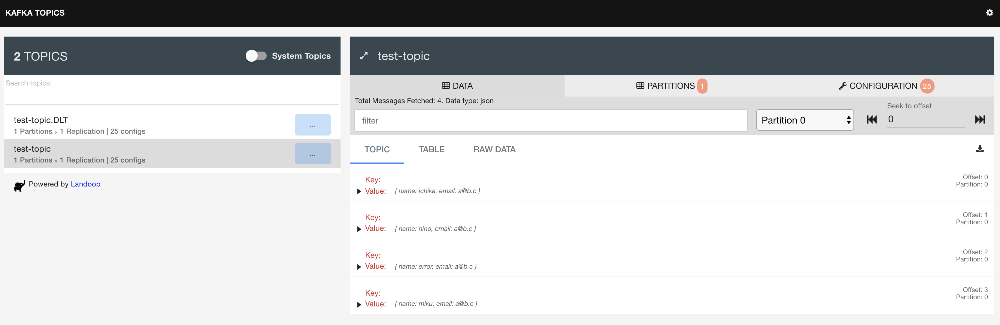

# kafka_demo

### Send message
Use [KafkaTemplate](https://docs.spring.io/spring-kafka/api/org/springframework/kafka/core/KafkaTemplate.html) to send a message.

### Receive　message
Use [@KafkaListener](https://docs.spring.io/spring-kafka/api/org/springframework/kafka/annotation/KafkaListener.html) annotation to listen messages.

### Error recovery
[SeekToCurrentErrorHandler](https://docs.spring.io/spring-kafka/api/org/springframework/kafka/listener/SeekToCurrentErrorHandler.html) enable to seeks to the current offset if message failure.
Thereby the message can be replayed.


In the following example, it will be retried 5 times every 5 seconds.
```
val factory = ConcurrentKafkaListenerContainerFactory<String, User>()
factory.consumerFactory = consumerFactory

val errorHandler = SeekToCurrentErrorHandler(FixedBackOff(5000, 5))
factory.setErrorHandler(errorHandler)
```

We can also send the failed message to another topic(dead letter topic).
```
val factory = ConcurrentKafkaListenerContainerFactory<String, User>()
factory.consumerFactory = consumerFactory

val errorHandler = SeekToCurrentErrorHandler(
    DeadLetterPublishingRecoverer(kafkaTemplate), <- THIS!
    FixedBackOff(5000, 5)
)
factory.setErrorHandler(errorHandler)
```

```
@KafkaListener(topics = ["test-topic.DLT"], groupId = "test-group")
fun recover(@Payload user: User) {
    println("message failed: $user")
}
```
If I have topic `hoge`, the dead letter topic will be `hoge.DLT`.

### Monitoring
Browse Kafka topics with [kafka-topics-ui](https://github.com/lensesio/kafka-topics-ui).

http://127.0.0.1:8000



Setup kafka-topics-ui with [docker-compose](docker-compose.yml).
